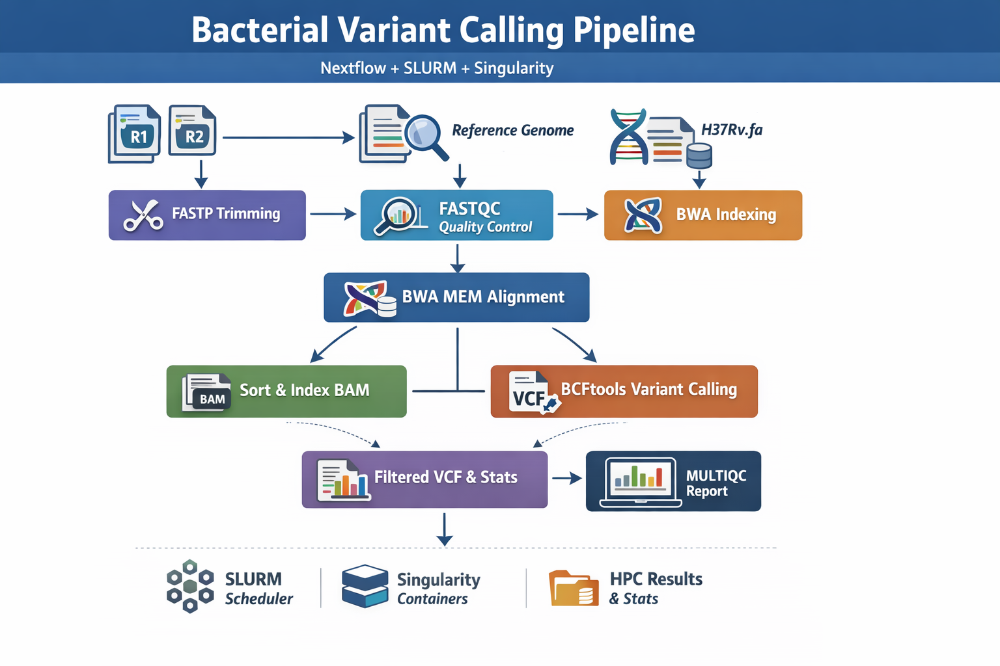

# nf-bacteria-variant-calling

  

A reproducible **Nextflow DSL2 pipeline** for bacterial whole-genome variant calling on HPC using **SLURM + Singularity/Apptainer**.

This project demonstrates a **real, production-style genomics workflow** using public Illumina paired-end reads aligned to the *Mycobacterium tuberculosis* H37Rv reference genome.

---

## Pipeline Overview

The workflow performs:

1. **Read trimming** — `fastp`
2. **Quality control** — `FastQC`
3. **QC aggregation** — `MultiQC`
4. **Reference indexing** — `bwa index`
5. **Read alignment** — `bwa mem`
6. **BAM sorting + indexing** — `samtools`
7. **Variant calling** — `bcftools mpileup + call`
8. **Variant filtering + statistics** — `bcftools filter + stats`

---

## Repository Structure

## Requirements

- Nextflow (DSL2)
- Singularity or Apptainer
- SLURM scheduler (for HPC execution)

On ilifu:

module load nextflow
module load singularity

---

## Quickstart (ilifu / SLURM)

### Create required directories (once)

mkdir -p /cbio/users/simon/.singularity/cache

mkdir -p /cbio/users/simon/nextflow_work

Download example dataset
./scripts/download_tb_reads_ena.sh data/reads

Download H37Rv reference:

./scripts/download_h37rv_ref.sh data/ref

## Create samplesheet:

./scripts/make_samplesheet.sh data/samplesheet.csv
Run the pipeline
nextflow run main.nf \
  -profile ilifu \
  --samplesheet data/samplesheet.csv \
  --ref data/ref/H37Rv.fa \
  -with-report -with-timeline -with-trace

## Resume after interruption:

nextflow run main.nf -profile ilifu -resume
Input Format
Samplesheet CSV
sample_id,fastq_1,fastq_2
ERR2510654,data/reads/ERR2510654_1.fastq.gz,data/reads/ERR2510654_2.fastq.gz
Reference genome
data/ref/H37Rv.fa

(Genome accession: NC_000962.3)

Outputs

Pipeline outputs are written to:

results/
QC
results/fastqc/
results/multiqc/multiqc_report.html
Alignment
results/bam/*.sorted.bam
Variants
results/vcf/*.vcf.gz
results/vcf_filtered/*.filtered.vcf.gz
results/vcf_filtered/*.vcfstats.txt
Nextflow reports
report.html
timeline.html
trace.txt

## Variant Filtering Criteria

Default filters (editable in main.nf):

QUAL ≥ 20

Depth ≥ 10

## Reproducibility

All tools executed in pinned biocontainer images

Workflow controlled via Nextflow profiles

Fully reproducible on SLURM-based HPC clusters

## Author

Simon Mufara -
MSc Computational Health Informatics — University of Cape Town

Interests:
Genomics pipelines, Reproducible bioinformatics, AI-driven healthcare analytics

## License

MIT License 