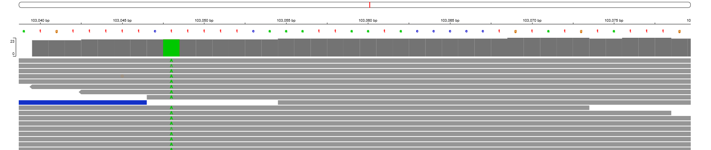

# nf-bacteria-variant-calling

<p align="center">


</p>

<p align="center">
  
</p>

---

## Overview

A reproducible **Nextflow DSL2 pipeline** for bacterial whole-genome variant calling on HPC using **SLURM + Singularity/Apptainer**.

This project demonstrates a **production-style genomics workflow** using public Illumina paired-end reads aligned to the *Mycobacterium tuberculosis* H37Rv reference genome, encompassing quality control, read alignment, variant calling, and visualization.

---

## Table of Contents

- [Quick Start](#quick-start)
- [Pipeline Overview](#pipeline-overview)
- [Results & Visualization](#results--visualization)
- [Repository Structure](#repository-structure)
- [Requirements](#requirements)
- [Input Format](#input-format)
- [Outputs](#outputs)
- [Variant Filtering](#variant-filtering)
- [Reproducibility](#reproducibility)
- [Author & License](#author--license)

---

## Quick Start

### Prerequisites

Ensure you have the required modules loaded on ilifu/SLURM:

```bash
module load nextflow
module load singularity
```

### Setup (One-time)

Create required directories:

```bash
mkdir -p /cbio/users/simon/.singularity/cache
mkdir -p /cbio/users/simon/nextflow_work
```

### Download Data

Download example TB reads:

```bash
./scripts/download_tb_reads_ena.sh data/reads
```

Download H37Rv reference genome:

```bash
./scripts/download_h37rv_ref.sh data/ref
```

Create samplesheet:

```bash
./scripts/make_samplesheet.sh data/samplesheet.csv
```

### Run Pipeline

Execute the pipeline with:

```bash
nextflow run main.nf \
  -profile ilifu \
  --samplesheet data/samplesheet.csv \
  --ref data/ref/H37Rv.fa \
  -with-report -with-timeline -with-trace
```

### Resume After Interruption

To resume a failed run:

```bash
nextflow run main.nf -profile ilifu -resume
```

---

## Pipeline Overview

The workflow performs the following sequential steps:

1. **Read Trimming** — `fastp` — Removes adapters and low-quality bases
2. **Quality Control** — `FastQC` — Per-sample sequencing quality assessment
3. **QC Aggregation** — `MultiQC` — Aggregated quality report
4. **Reference Indexing** — `bwa index` — Index the reference genome
5. **Read Alignment** — `bwa mem` — Align paired-end reads to reference
6. **BAM Sorting & Indexing** — `samtools` — Sort and index alignment files
7. **Variant Calling** — `bcftools mpileup + call` — Call variants from alignments
8. **Variant Filtering & Statistics** — `bcftools filter + stats` — Filter and report variants

---

## Results & Visualization

### QC Report

An example MultiQC report generated from real MTB sequencing data:

**[📊 Open MultiQC Report](docs/multiqc_report.html)**

**Key Highlights:**
- ~99% reads retained after quality trimming
- Q30 ≈ 95% (high-quality bases)
- GC content ≈ 65% (consistent with *M. tuberculosis*)
- ~1.9k variants detected versus H37Rv

### Variant Visualization with IGV

Below is an example IGV (Integrative Genomics Viewer) visualization of a high-confidence variant detected by this pipeline:

<p align="center">
  
</p>

**Variant Details (Position 103048):**

| Attribute | Value |
|-----------|-------|
| **Type** | SNP (Single Nucleotide Polymorphism) |
| **Substitution** | T → A |
| **Genotype** | 1/1 (homozygous) |
| **Read Depth** | 21 reads |
| **Quality Score** | 225.417 |

**Visualization Interpretation:**

- **Green vertical column** — Position 103048 (variant location)
- **Green "A" bases** — Individual sequencing reads showing the alternate allele
- **Gray horizontal bars** — Aligned read pairs spanning the region
- **Blue bar** — Forward/reverse read orientation indicator
- **All reads show "A" allele** — Confirms high-confidence homozygous variant call

---

## Repository Structure

```
nf-bacteria-variant-calling/
├── main.nf                          # Main Nextflow workflow (DSL2)
├── nextflow.config                  # Nextflow configuration
├── conf/
│   ├── base.config                  # Base resource configuration
│   ├── ilifu.config                 # ilifu HPC profile config
│   └── genomes.config               # Reference genome paths
├── modules/                         # Nextflow modules (DSL2)
│   ├── fastp.nf
│   ├── fastqc.nf
│   ├── multiqc.nf
│   ├── bwa_index.nf
│   ├── bwa_align.nf
│   ├── samtools_sort.nf
│   ├── bcftools_call.nf
│   └── bcftools_filter.nf
├── data/
│   ├── reads/                       # Raw FASTQ files
│   └── ref/                         # Reference genomes
├── results/                         # Pipeline outputs
│   ├── fastqc/
│   ├── multiqc/
│   ├── bam/
│   ├── vcf/
│   └── vcf_filtered/
├── scripts/                         # Utility scripts
│   ├── download_tb_reads_ena.sh
│   ├── download_h37rv_ref.sh
│   └── make_samplesheet.sh
├── docs/
│   ├── pipeline.png
│   ├── igv_variant_visualization.png
│   └── multiqc_report.html
├── README.md                        # This file
└── CITATION.cff                     # Citation metadata
```

---

## Requirements

### Software

- **Nextflow** (DSL2) — v22.04.0 or later
- **Singularity** or **Apptainer** — Container runtime
- **SLURM** scheduler — For HPC job submission

### Module Loading (ilifu)

```bash
module load nextflow
module load singularity
```

### System Resources

Default resource requests per task:

- **CPU:** 4 cores
- **Memory:** 8 GB
- **Time:** 24 hours

Adjust in `conf/ilifu.config` as needed.

---

## Input Format

### Samplesheet (CSV)

Create a CSV file with the following columns:

| Column | Description |
|--------|-------------|
| `sample_id` | Unique sample identifier |
| `fastq_1` | Path to R1 FASTQ file (forward reads) |
| `fastq_2` | Path to R2 FASTQ file (reverse reads) |

**Example:**

```csv
sample_id,fastq_1,fastq_2
ERR2510654,data/reads/ERR2510654_1.fastq.gz,data/reads/ERR2510654_2.fastq.gz
ERR2510655,data/reads/ERR2510655_1.fastq.gz,data/reads/ERR2510655_2.fastq.gz
```

### Reference Genome

FASTA format reference genome file:

```
data/ref/H37Rv.fa
```

**Genome Accession:** NC_000962.3 (*Mycobacterium tuberculosis* H37Rv)

---

## Outputs

Pipeline outputs are written to the `results/` directory:

### Quality Control

| Directory | Contents |
|-----------|----------|
| `results/fastqc/` | Per-sample FastQC HTML reports |
| `results/multiqc/multiqc_report.html` | Aggregated QC report for all samples |

### Alignment

| File | Description |
|------|-------------|
| `results/bam/*.sorted.bam` | Sorted BAM alignment files |
| `results/bam/*.sorted.bam.bai` | BAM index files |

### Variant Calls

| File | Description |
|------|-------------|
| `results/vcf/*.vcf.gz` | Raw variant calls (compressed VCF) |
| `results/vcf_filtered/*.filtered.vcf.gz` | Filtered variants |
| `results/vcf_filtered/*.vcfstats.txt` | Variant statistics |

### Nextflow Reports

| File | Description |
|------|-------------|
| `report.html` | Execution report with task metrics |
| `timeline.html` | Task timeline visualization |
| `trace.txt` | Detailed task execution trace |

---

## Variant Filtering

### Default Filter Criteria

Variants are filtered based on:

| Criterion | Threshold | Rationale |
|-----------|-----------|-----------|
| **Quality (QUAL)** | ≥ 20 | Minimum base quality score |
| **Depth (DP)** | ≥ 10 | Minimum read depth |

These thresholds are configurable in `main.nf` and can be adjusted for different sensitivity/specificity requirements.

---

## Reproducibility

### Key Features

✅ **Containerization** — All tools packaged in versioned Biocontainer images (no dependency conflicts)

✅ **Infrastructure as Code** — Nextflow profiles (ilifu) for consistent HPC configuration

✅ **Version Control** — Pinned tool versions in container definitions

✅ **Standard Outputs** — Consistent directory structure and file naming

### Running Reproducibly

To ensure full reproducibility on other SLURM clusters:

1. Load required modules (Nextflow, Singularity)
2. Point to your own reference genome if needed (edit `conf/genomes.config`)
3. Run with the appropriate profile: `-profile ilifu` (or create your own)
4. All intermediate files are preserved for inspection and debugging

---

## Author & License

### Author

**Simon Mufara**
MSc Computational Health Informatics — University of Cape Town

**Research Interests:**
- Genomics pipeline development
- Reproducible bioinformatics workflows
- AI-driven healthcare analytics

### License

MIT License — See LICENSE file for details

### Citation

If you use this pipeline, please cite:

```bibtex
@software{Mufara2024,
  author = {Mufara, Simon},
  title = {nf-bacteria-variant-calling: A Nextflow DSL2 pipeline for bacterial variant calling},
  year = {2024},
  url = {https://github.com/Simon-Mufara/nf-bacteria-variant-calling}
}
```

---

**Last Updated:** March 2024
**Contact:** For questions or issues, please open an issue on GitHub.
